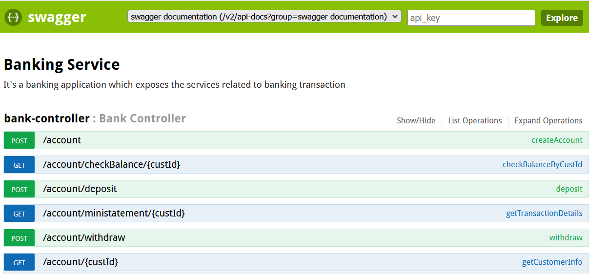
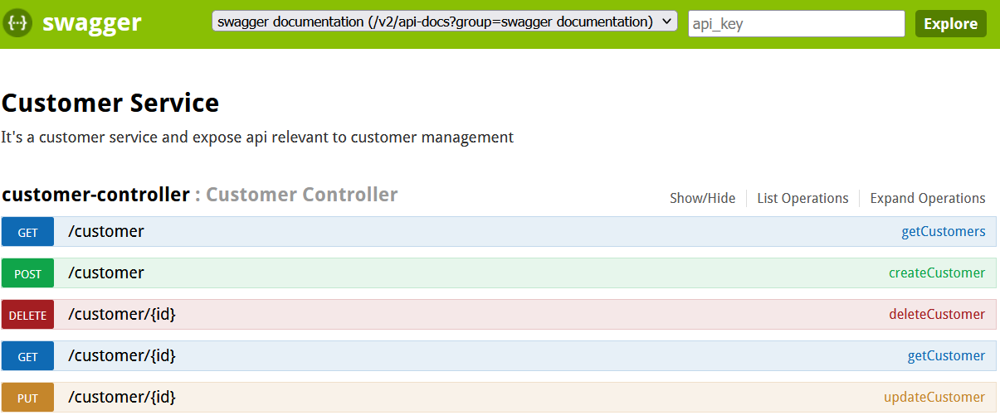

## API Documentation using Swagger
API documentation will be really helpful to understand the API request, and it's response. It's really helpful for the developers and improve the productivity.

### Service Details:
I have created the below 3 services and specify the more details about the services

`service-registry`: It's responsible for registering all services into Eureka server for service discovery. It will help to locate the services very easily.

`banking-services`: It's responsible for creating new account, deposit/withdraw the amount, get the customer details, check balance and monitor all transactions.

`customer-service`: It's responsible for all CURD operation related to customer

|S.No| Service-Name|Port| API                            |H2-console| DB Url |
-----|-------------|----|--------------------------------|----------|--------|
1| service-registry|8761| N/A                            |N/A| N/A    |
2| banking-service|9001| http://localhost:9001/account  |http://localhost:9001/h2-console| jdbc:h2:mem:banking |
3| customer-service|9002| http://localhost:9002/customer |http://localhost:9002/h2-console|jdbc:h2:mem:customer|

We can interact to H2-console directly from the browser by hitting the above H2-console url and also, make sure you had given the correct JDBC URL to connect the H2 Database. Click on `Test Connection` button to validate the database connection.

After that, click on `Connect` button to login to the actual H2 database. You can verify the schema and execute the query to validate the data from the database.

## Access API Documentation Page
The `banking-service` swagger API documentation can be accessed through http://localhost:9001/swagger-ui.html url. Please refer the below screenshot for more reference.

The `customer-service` swagger API documentation can be accessed through http://localhost:9002/swagger-ui.html url. Please refer the below screenshot for more reference.

### API Details:
Please refer the below list of APIs provided by the `banking-service`

**POST** http://localhost:9001/account

payload:`{
"name": "Arun",
"amount": 2000.0,
"phone": "xxxxxxxxxx",
"email": "xxxx@gmail.com"
}`

response: `{
"status": "success",
"message": "Successfully created the bank account",
"customerId": 1,
"accountNo": 45877048
}`

**POST** http://localhost:9001/account/deposit

payload:`{
"customerId": 1,
"accountNo": 45877048,
"amount": 1000.0
}`

response: `{
"status": "success",
"message": "Successfully updated the balance",
"balance": 3000.0
}`

**POST** http://localhost:9001/account/withdraw

payload:`{
"customerId": 1,
"accountNo": 45877048,
"amount": 500.0
}`

response: `{
"status": "success",
"message": "Successfully updated the balance",
"balance": 2500.0
}`

**GET** http://localhost:9001/account/{custId}

response: `{
"id": 1,
"name": "Arun",
"accountNo": 45877048,
"balance": 4000.0,
"phone": "xxxxxxxxxx",
"emailId": "xxxx@gmail.com"
}`

**GET** http://localhost:9001/account/checkBalance/{custId}

response: `Arun your account number 45877048 has balance Rs:2500.0`

**GET** http://localhost:9001/account/ministatement/{custId}

response: `{
"name": "Arun",
"customerId": 1,
"accountNo": 45877048,
"balance": 2500.0,
"transactions": [
{
"customerId": 1,
"accountNo": 45877048,
"transactionType": "ACCOUNT_CREATED",
"amount": 2000.0,
"date": "16-10-2022 22:48:47",
"id": 1
},
{
"customerId": 1,
"accountNo": 45877048,
"transactionType": "CREDIT",
"amount": 1000.0,
"date": "16-10-2022 22:49:29",
"id": 2
},
{
"customerId": 1,
"accountNo": 45877048,
"transactionType": "DEBIT",
"amount": 500.0,
"date": "16-10-2022 22:49:49",
"id": 3
}
]
}`

Actually the above APIs are internally make a call to `customer-service` to fetch the actual response. The `customer-service` also exposed the APIs which can be accessed directly.

Please refer the below list of APIs provided by the `customer-service`

**GET** http://localhost:9002/customer/

response: `[
{
"id": 1,
"name": "Arun",
"accountNo": 45877048,
"balance": 2000.0,
"phone": "xxxxxxxxxx",
"emailId": "xxxx@gmail.com"
}
]`

**GET** http://localhost:9002/customer/{custId}

response: `{
"id": 1,
"name": "Arun",
"accountNo": 45877048,
"balance": 2000.0,
"phone": "xxxxxxxxxx",
"emailId": "xxxx@gmail.com"
}`

**POST** http://localhost:9002/customer

payload:`{
"name":"Arun",
"amount": 2000.0,
"phone":"xxxxxxxxxx",
"emailId":"xxxx@gmail.com"
}`

response: `{
"id": 1,
"name": "Arun",
"accountNo": 45877048,
"balance": 2000.0,
"phone": "xxxxxxxxxx",
"emailId": "xxxx@gmail.com"
}`

**PUT** http://localhost:9002/customer/{custId}

payload:`{
"id": 1,
"accountNo": 45877048,
"amount": 5000.0
}`

response: `{
"id": 1,
"name": "Arun",
"accountNo": 45877048,
"balance": 5000.0,
"phone": "xxxxxxxxxx",
"emailId": "xxxx@gmail.com"
}`

**DELETE** http://localhost:9002/customer/{custId}

response: None

### Start and access Eureka server:
*Note: We need to start the `service-registry` service before starting of any services(`banking-service`/`customer-service`) to be registered with Eureka server.*

Finally, the `banking-service` and `customer-service` are registered with Eureka server which is running on the URL http://localhost:8761/. You can access the URL from the browser to see the list of services registered with Eureka server.