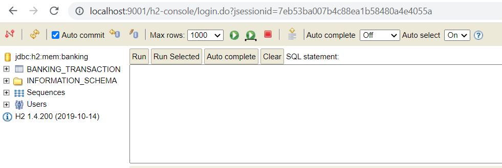

## Microservices interact with H2 in-memory Database
Each service can have its own database to store the data which will avoid tight coupling between services. This example shows the interaction between microservices and the in-memory H2 database.

The below microservice design pattern used for this example
1. service per database: Each service has its own database to store the data and also, it has the ability to run the application individually without having the dependency with other services (loosely coupled)
2. Aggregate pattern: The `banking-service` can interact with other services to construct the expected response to the client.

### Process of service interaction to H2 Database:
Please refer the below architecture diagram to understand about the services interacting with H2 database.

### Service Details:
I have created the below 4 services and specify the more details about the services

`service-registry`: It's responsible for registering all services into Eureka server for service discovery. It will help to locate the services very easily.

`banking-services`: It's responsible for creating new account, deposit/withdraw the amount, apply for loan, get the customer details, check balance and monitor all transactions.

`customer-service`: It's responsible for all CURD operation related to customer

`loan-service`: It's responsible for check for loan eligibility, approve/decline the loan, validating the customer details, save and monitor all loan transactions.

|S.No| Service-Name|Port| API |H2-console| DB Url |
-----|-------------|----|-----|----------|--------|
1| service-registry|8761| N/A |N/A| N/A    |
2| banking-service|9001| http://localhost:9001/account|http://localhost:9001/h2-console| jdbc:h2:mem:banking |
3| customer-service|9002| http://localhost:9002/customer|http://localhost:9002/h2-console|jdbc:h2:mem:customer|
4| loan-service|9003| http://localhost:9002/loan| http://localhost:9003/h2-console|jdbc:h2:mem:loan|

We can interact to H2-console directly from the browser by hitting the above H2-console url and also, make sure you had given the correct JDBC URL to connect the H2 Database. Click on `Test Connection` button to validate the database connection.

After that, click on `Connect` button to login to the actual H2 database. You can verify the schema and execute the query to validate the data from the database.

### API Details:
Please refer the below list of APIs provided by the `banking-service`

**POST** http://localhost:9001/account

payload:`{
"name": "Arun",
"amount": 2000.0,
"phone": "xxxxxxxxxx",
"email": "xxxx@gmail.com"
}`

response: `{
"status": "success",
"message": "Successfully created the bank account",
"customerId": 1,
"accountNo": 45877048
}`

**POST** http://localhost:9001/account/deposit

payload:`{
"customerId": 1,
"accountNo": 45877048,
"amount": 1000.0
}`

response: `{
"status": "success",
"message": "Successfully updated the balance",
"balance": 3000.0
}`

**POST** http://localhost:9001/account/withdraw

payload:`{
"customerId": 1,
"accountNo": 45877048,
"amount": 500.0
}`

response: `{
"status": "success",
"message": "Successfully updated the balance",
"balance": 2500.0
}`

**POST** http://localhost:9001/account/loan

payload:`{
"name":"Arun",
"age": 39,
"custId":1,
"accountNo": 45877048,
"income": 30000,
"employmentType": "MNC",
"amount": 200000.0,
"tenture": 24
`

response: `{
"id": 1,
"status": "ACCEPTED",
"message": "You are eligible for the loan",
"amount": 200000.0,
"tenture": 24
}`

**GET** http://localhost:9001/account/{custId}

response: `{
"id": 1,
"name": "Arun",
"accountNo": 45877048,
"balance": 4000.0,
"phone": "xxxxxxxxxx",
"emailId": "xxxx@gmail.com",
"loanDetails": [
{
"id": 1,
"amount": 200000.0,
"tenture": 24,
"customerId": 1,
"accountNo": 45877048
}
]
}`

**GET** http://localhost:9001/account/checkBalance/{custId}

response: `Arun your account number 45877048 has balance Rs:2500.0`

**GET** http://localhost:9001/account/ministatement/{custId}

response: `{
"name": "Arun",
"customerId": 1,
"accountNo": 45877048,
"balance": 2500.0,
"transactions": [
{
"customerId": 1,
"accountNo": 45877048,
"transactionType": "ACCOUNT_CREATED",
"amount": 2000.0,
"date": "16-10-2022 22:48:47",
"id": 1
},
{
"customerId": 1,
"accountNo": 45877048,
"transactionType": "CREDIT",
"amount": 1000.0,
"date": "16-10-2022 22:49:29",
"id": 2
},
{
"customerId": 1,
"accountNo": 45877048,
"transactionType": "DEBIT",
"amount": 500.0,
"date": "16-10-2022 22:49:49",
"id": 3
}
]
}`

Actually the above APIs are internally make a call to `customer-service` and `loan-service` to fetch the actual response. The `customer-service` also exposed the APIs which can be accessed directly.

Please refer the below list of APIs provided by the `customer-service`

**GET** http://localhost:9002/customer/

response: `[
{
"id": 1,
"name": "Arun",
"accountNo": 45877048,
"balance": 2000.0,
"phone": "xxxxxxxxxx",
"emailId": "xxxx@gmail.com"
}
]`

**GET** http://localhost:9002/customer/{custId}

response: `{
"id": 1,
"name": "Arun",
"accountNo": 45877048,
"balance": 2000.0,
"phone": "xxxxxxxxxx",
"emailId": "xxxx@gmail.com"
}`

**POST** http://localhost:9002/customer

payload:`{
"name":"Arun",
"amount": 2000.0,
"phone":"xxxxxxxxxx",
"emailId":"xxxx@gmail.com"
}`

response: `{
"id": 1,
"name": "Arun",
"accountNo": 45877048,
"balance": 2000.0,
"phone": "xxxxxxxxxx",
"emailId": "xxxx@gmail.com"
}`

**PUT** http://localhost:9002/customer/{custId}

payload:`{
"id": 1,
"accountNo": 45877048,
"amount": 5000.0
}`

response: `{
"id": 1,
"name": "Arun",
"accountNo": 45877048,
"balance": 5000.0,
"phone": "xxxxxxxxxx",
"emailId": "xxxx@gmail.com"
}`

**DELETE** http://localhost:9002/customer/{custId}

response: None

Please refer the below list of APIs provided by the `loan-service`

**GET** http://localhost:9003/loan

response: `[
{
"id": 1,
"amount": 200000.0,
"tenture": 24,
"customerId": 1,
"accountNo": 45877048
}
]`

**GET** http://localhost:9003/loan/{loanId}

response: `{
"id": 3,
"amount": 200000.0,
"tenture": 24,
"customerId": 1,
"accountNo": 45877048
}`

**POST** http://localhost:9003/loan

payload:`{
"name":"Arun",
"age": 39,
"custId":1,
"accountNo": 45877048,
"income": 40000,
"employmentType": "MNC",
"amount": 250000.0,
"tenture": 36
}`

response: `{
"id": 5,
"status": "ACCEPTED",
"message": "You are eligible for the loan",
"amount": 250000.0,
"tenture": 36
}`

**PUT** http://localhost:9003/loan/{loanId}

payload:`{
"amount": 350000.0,
"tenture": 48,
}`

response: `{
"id": 1,
"amount": 350000.0,
"tenture": 48,
"customerId": 1,
"accountNo": 45877048
}`

**DELETE** http://localhost:9003/loan/{loanId}

response: None

**GET** http://localhost:9003/loan/transaction

response: `[
{
"loanId": 2,
"status": "ACCEPTED",
"message": "You are eligible for the loan",
"amount": 250000.0,
"tenture": 36,
"date": "16-10-2022 23:19:22"
},
{
"loanId": 3,
"status": "REJECTED",
"message": "You are not eligible for loan",
"amount": 0.0,
"tenture": 0,
"date": "16-10-2022 23:23:16"
},
{
"loanId": 5,
"status": "ACCEPTED",
"message": "You are eligible for the loan",
"amount": 400000.0,
"tenture": 48,
"date": "16-10-2022 23:23:44"
},
{
"loanId": 6,
"status": "CLOSED",
"message": "You have closed the loan",
"amount": 0.0,
"tenture": 0,
"date": "16-10-2022 23:24:23"
}
]`

### Start and access Eureka server:
*Note: We need to start the `service-registry` service before starting of any services(`banking-service`/`customer-service`/`loan-service`) to be registered with Eureka server.*

Finally, the `banking-service`, `customer-service` and `loan-service` are registered with Eureka server which is running on the URL http://localhost:8761/. You can access the URL from the browser to see the list of services registered with Eureka server.

Please refer the below screenshot for more reference.
