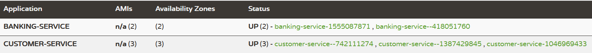

## Scaling the services in Microservice architecture
Some circumference, we need to scale the services depend upon on-demand basis to handle the number of requests from the client. So, we can create the multiple instances (scaling) of the services to share the workload between services.  

### Service Details:
I have created the below 3 services and specify the more details about the services

`service-registry`: It's responsible for registering all services into Eureka server for service discovery. It will help to locate the services very easily.

`banking-services`: It's responsible for creating new account, deposit/withdraw the amount, get the customer details, check balance and monitor all transactions.

`customer-service`: It's responsible for all CURD operation related to customer

|S.No| Service-Name|Port| API                            |H2-console| DB Url |
-----|-------------|----|--------------------------------|----------|--------|
1| service-registry|8761| N/A                            |N/A| N/A    |
2| banking-service|9001| http://localhost:9001/account  |http://localhost:9001/h2-console| jdbc:h2:mem:banking |
3| customer-service|9002| http://localhost:9002/customer |http://localhost:9002/h2-console|jdbc:h2:mem:customer|

## Techniques to create the multiple instances
The service `instance-id` and the `port` should not be static because we should run the multiple instances so, it any static details of `instance-id` and `port` will not allow to scale the same instance. So, we have to use dynamic `instance-id` and `port` for scaling the instances then it will allow scaling n number of instances.

*Note: The API won't work because dynamic port and instance created for the services.*

### Start and access Eureka server:
*Note: We need to start the `service-registry` service before starting of any services(`banking-service`/`customer-service`) to be registered with Eureka server.*

Finally, the `banking-service` and `customer-service` are registered with Eureka server which is running on the URL http://localhost:8761/. You can access the URL from the browser to see the list of services registered with Eureka server.

Please refer the below screenshot for your reference.

